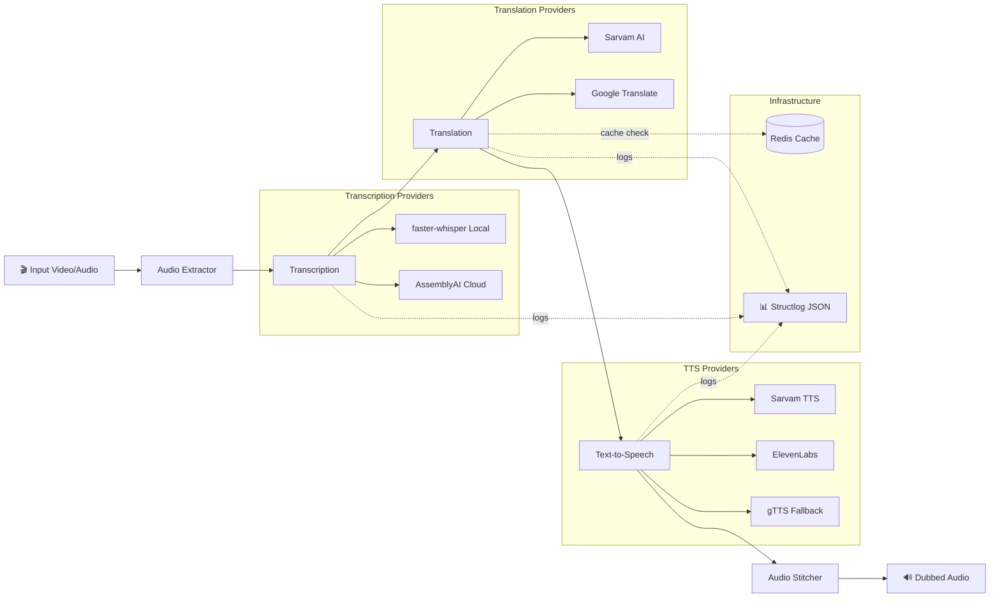

# 🎙️ VaaniFlow

**Production-grade multilingual async dubbing pipeline** supporting 11 Indian languages.

> Transcribe → Translate → Synthesize → Stitch — fully async, with provider fallback and structured observability.

---

## 🏗️ Architecture



---

## ⚡ Quick Start

### Using Docker (Recommended)

```bash
# Clone and configure
git clone https://github.com/your-username/vaaniflow.git
cd vaaniflow
cp .env.example .env
# Edit .env with your API keys

# Start everything
cd docker
docker-compose up --build
```

### Local Development

```bash
# Create virtual environment
python -m venv venv
venv\Scripts\activate  # Windows
# source venv/bin/activate  # Linux/Mac

# Install dependencies
pip install -e ".[dev]"

# Start the server
uvicorn api.main:app --reload --port 8000
```

### Prerequisites

- **Python 3.11+**
- **ffmpeg** — required for audio extraction ([download](https://ffmpeg.org/download.html))
- **Redis** — optional, falls back to in-memory cache

---

## 📡 API Usage

### Create a Dubbing Job

```bash
curl -X POST http://localhost:8000/jobs/ \
  -F "file=@input_video.mp4" \
  -F "target_language=hi" \
  -F "source_language=en" \
  -F "tts_provider=sarvam"
```

**Response (202 Accepted):**
```json
{
  "job_id": "a1b2c3d4-e5f6-7890-abcd-ef1234567890",
  "status": "pending",
  "progress_pct": 0.0
}
```

### Poll Job Status

```bash
curl http://localhost:8000/jobs/{job_id}
```

**Response:**
```json
{
  "job_id": "a1b2c3d4-...",
  "status": "translating",
  "progress_pct": 35.0
}
```

### Download Dubbed Audio

```bash
curl -O http://localhost:8000/jobs/{job_id}/download
```

### Health Check

```bash
curl http://localhost:8000/health/
curl http://localhost:8000/health/ready
```

---

## 🌍 Supported Languages

| Language   | Code | Transcription | Translation | TTS (Sarvam) | TTS (ElevenLabs) | TTS (gTTS) |
|------------|------|:---:|:---:|:---:|:---:|:---:|
| English    | `en` | ✅ | ✅ | ✅ | ✅ | ✅ |
| Hindi      | `hi` | ✅ | ✅ | ✅ | ✅ | ✅ |
| Bengali    | `bn` | ✅ | ✅ | ✅ | ✅ | ✅ |
| Telugu     | `te` | ✅ | ✅ | ✅ | ✅ | ✅ |
| Marathi    | `mr` | ✅ | ✅ | ✅ | ✅ | ✅ |
| Tamil      | `ta` | ✅ | ✅ | ✅ | ✅ | ✅ |
| Gujarati   | `gu` | ✅ | ✅ | ✅ | ✅ | ✅ |
| Kannada    | `kn` | ✅ | ✅ | ✅ | ✅ | ✅ |
| Malayalam  | `ml` | ✅ | ✅ | ✅ | ✅ | ✅ |
| Punjabi    | `pa` | ✅ | ✅ | ✅ | ✅ | ✅ |
| Odia       | `or` | ✅ | ✅ | ✅ | — | ✅ |

---

## 🔌 Provider Comparison

| Feature | Sarvam AI | ElevenLabs | gTTS (Fallback) |
|---------|-----------|------------|-----------------|
| **Quality** | ⭐⭐⭐⭐⭐ (Indian langs) | ⭐⭐⭐⭐⭐ (English) | ⭐⭐⭐ |
| **Cost** | API key required | API key required | **Free** |
| **Latency** | ~500ms | ~800ms | ~300ms |
| **Indian Language Support** | 11 languages | 9 languages | 11 languages |
| **Voice Cloning** | ❌ | ✅ | ❌ |
| **Rate Limits** | Moderate | Strict | Google-level |
| **Use Case** | Primary for Indian | Premium English | Always-on fallback |

---

## 🧠 Design Decisions

### Why Provider Abstraction (ABC)?
Every TTS/Translation/Transcription provider implements the same interface. The pipeline never imports a concrete provider — only the base class. This enables:
- **Zero-code provider switching** via config
- **Automatic fallback** when primary fails
- **Easy testing** with mock providers

### Why Custom Exception Hierarchy?
Sarvam's JD specifically asks to *"distinguish rate limits from auth errors from server failures."* Our hierarchy:
- `RateLimitError` → retry with exponential backoff
- `AuthenticationError` → fail immediately (config issue)
- `ProviderServerError` → retry with fixed wait
- `ProviderTimeoutError` → retry once, then fallback

### Why Redis Cache?
Translation API calls are expensive and often repeated (same phrases across jobs). Redis caching with 24h TTL dramatically reduces costs. Falls back to in-memory dict if Redis is unavailable.

### Why Concurrent TTS?
`asyncio.gather` synthesizes all segments in parallel instead of sequentially, giving **3–4x throughput** improvement for multi-segment audio.

### Why structlog?
JSON-structured logging with `contextvars` means every log event in a pipeline run automatically includes `job_id` and `target_lang` — critical for debugging production systems with concurrent jobs.

---

## 🧪 Running Tests

```bash
# All tests
pytest -v

# Unit tests only
pytest tests/unit/ -v

# Integration tests only
pytest tests/integration/ -v

# With coverage
pytest --cov=vaaniflow --cov=api -v
```

---

## 📁 Project Structure

```
vaaniflow/
├── vaaniflow/                     # Core Python library
│   ├── pipeline.py                # Main orchestration
│   ├── config.py                  # Pydantic settings
│   ├── models.py                  # All data models
│   ├── exceptions.py              # Custom exceptions
│   ├── providers/                 # Provider abstraction layer
│   │   ├── transcription/         # Whisper, AssemblyAI
│   │   ├── translation/           # Google, Sarvam
│   │   └── tts/                   # ElevenLabs, Sarvam, gTTS
│   ├── audio/                     # Extractor, stitcher, normalizer
│   ├── cache/                     # Redis translation cache
│   └── utils/                     # Retry, logging, timing
├── api/                           # FastAPI service
│   ├── main.py                    # App + lifespan
│   ├── routes/                    # Jobs, health endpoints
│   └── middleware/                # Logging middleware
├── tests/                         # Unit + integration tests
├── docker/                        # Dockerfile + compose
├── pyproject.toml
└── README.md
```

---

## 📊 Performance Notes

- **Concurrent TTS synthesis**: All segments synthesized in parallel via `asyncio.gather`
- **Translation caching**: Redis-backed with 24h TTL — cache hit rates of 40–60% on repeated content
- **Lazy model loading**: Whisper model loaded on first use, not at import time
- **Non-blocking I/O**: Synchronous libraries (gTTS, faster-whisper) wrapped with `run_in_executor`
- **Background processing**: Jobs return 202 immediately; pipeline runs in FastAPI BackgroundTasks

---

## 📝 License

MIT
