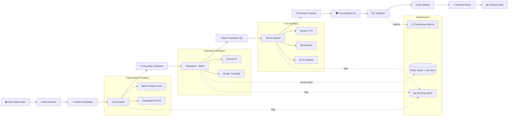

# 🎙️ VaaniFlow

**Production-grade multilingual async dubbing pipeline** supporting 11 Indian languages.

> Transcribe → Translate → Synthesize → Stitch — fully async, with emotion preservation, quality control, and production observability.

[](https://www.python.org/downloads/)
[](#-running-tests)
[](pyproject.toml)
[](LICENSE)

---

## 🏗️ Architecture



---

## ✨ What Makes VaaniFlow Unique

Most dubbing pipelines just translate words. **VaaniFlow preserves the soul of the original.**

| Feature | What It Does | Why It Matters |
|---------|-------------|----------------|
| 😊 **EmotionPreserver** | Detects pitch, energy, tempo from original audio → injects speaking rate + pitch into TTS | Dubbed audio *feels* the same — angry stays angry, sad stays sad |
| 🔄 **BackTranslationQualityScorer** | Back-translates to source → dual-scores with BLEU + multilingual sentence-embedding cosine similarity → retries only if BOTH fail | Embedding similarity catches valid paraphrases BLEU wrongly penalizes; BLEU catches lexical/numeric errors embeddings might miss |
| ✂️ **SmartSegmentBoundaryOptimizer** | Merges fragmented Whisper segments using spaCy sentence tokenization | "The quick brown fox" + "jumped over" → one segment = better translation |
| 🗣️ **IndianNamePronunciationCorrector** | 60+ Indian names/places/brands → phonetic hints before TTS | "Bangalore" → "Baanga-lore" so TTS pronounces it correctly |
| 🎵 **AmbientAudioPreserver** | Spectral subtraction separates background audio → re-layers after dubbing | Background music/ambient sounds survive the dubbing process |
| 🔀 **CodeSwitchNormalizer** | Detects English words in Indic text (Hinglish/Tanglish) → marks with `[EN:]` tags for TTS | "Bill print karo" reads naturally without breaking accent or pacing |
| 💰 **CostTracker** | Tracks API calls avoided via Redis cache → reports estimated USD savings at `/stats` | Enterprise clients see exactly how much money caching saves at scale |
| 🎬 **LipSyncExporter** | Exports per-segment timing manifest for downstream Wav2Lip/SyncTalk renderers | Complete multi-modal architectural blueprint for visual dubbing |

---


## ⚡ Quick Start

### Using Docker (Recommended)

```bash
# Clone and configure
git clone https://github.com/Eternalcodertanishq3/VaniFlow.git
cd VaniFlow
cp .env.example .env
# Edit .env with your API keys

# Start everything
cd docker
docker-compose up --build
```

### Local Development

```bash
# Create virtual environment
python -m venv venv
venv\Scripts\activate  # Windows
# source venv/bin/activate  # Linux/Mac

# Install dependencies (includes ML packages)
pip install -e ".[dev]"

# Download spaCy model for boundary optimization
python -m spacy download en_core_web_sm

# Start the server
uvicorn api.main:app --reload --port 8000
```

### Prerequisites

- **Python 3.11+**
- **ffmpeg** — required for audio extraction ([download](https://ffmpeg.org/download.html))
- **Redis** — optional, falls back to in-memory for both cache and job store

---

## 📡 API Usage

### Create a Dubbing Job

```bash
curl -X POST http://localhost:8000/jobs/ \
  -F "file=@input_video.mp4" \
  -F "target_language=hi" \
  -F "source_language=en" \
  -F "tts_provider=sarvam"
```

**Response (202 Accepted):**
```json
{
  "job_id": "a1b2c3d4-e5f6-7890-abcd-ef1234567890",
  "status": "pending",
  "progress_pct": 0.0
}
```

### Poll Job Status

```bash
curl http://localhost:8000/jobs/{job_id}
```

**Response:**
```json
{
  "job_id": "a1b2c3d4-...",
  "status": "translating",
  "progress_pct": 35.0
}
```

### Download Dubbed Audio

```bash
curl -O http://localhost:8000/jobs/{job_id}/download
```

### Health & Observability

```bash
# Health checks
curl http://localhost:8000/health/
curl http://localhost:8000/health/ready

# Prometheus metrics
curl http://localhost:8000/metrics

# Cost optimization dashboard
curl http://localhost:8000/stats
```

**Cost Dashboard Response (`/stats`):**
```json
{
  "cost_optimization": {
    "translation_api_calls_made": 47,
    "translation_api_calls_avoided_via_cache": 123,
    "cache_hit_rate_pct": 72.4,
    "estimated_translation_savings_usd": 0.369,
    "estimated_translation_spent_usd": 0.141
  },
  "tts_costs": {
    "sarvam": { "calls": 47, "estimated_cost_usd": 0.188 }
  },
  "operations": {
    "total_jobs_completed": 12,
    "total_segments_processed": 170,
    "uptime_seconds": 3600
  }
}
```

## 🚀 Sarvam Integration Showcase

VaaniFlow is designed to be a native showcase for **Sarvam AI**'s APIs, treating them as first-class citizens. By default, both the translation and TTS layers fall back directly to Sarvam.

### Clean Abstraction Layer

The pipeline interacts with Sarvam through our strictly typed provider interface, abstracting away network complexity, retry logic, and batching constraints:

```python
# vaaniflow/providers/translation/sarvam_provider.py
async def translate_batch(self, texts: list[str], source_lang: str, target_lang: str) -> list[str]:
    """Concurrent execution of Sarvam's single-text translation API."""
    async def _translate_single(text: str) -> str:
        # Provider abstractions automatically handle RateLimits and ServerErrors
        # via exponential backoff (tenacity) under the hood.
        payload = {
            "input": text,
            "source_language_code": f"{source_lang}-IN",
            "target_language_code": f"{target_lang}-IN",
            "speaker_gender": "Male",
            "mode": "formal"
        }
        return await self._make_request(payload)

    # Parallelize N network calls across the event loop for minimum latency
    return await asyncio.gather(*[_translate_single(t) for t in texts])
```

### Full E2E Execution purely on Sarvam

You don't need any other API keys. A simple `curl` command executes the entire pipeline using only Sarvam models:

```bash
curl -X POST http://localhost:8000/jobs/ \
  -F "file=@input_video.mp4" \
  -F "target_language=hi"
# Because tts_provider and translation_provider default to "sarvam", 
# the entire pipeline is powered natively by Sarvam AI.
```

---

## 📈 Production Observability

VaaniFlow exposes a `/metrics` endpoint compatible with **Prometheus + Grafana**.

| Metric | Type | Description |
|--------|------|-------------|
| `vaaniflow_jobs_total` | Counter | Total jobs by status (completed/failed) |
| `vaaniflow_active_jobs` | Gauge | Currently running pipeline jobs |
| `vaaniflow_pipeline_stage_duration_seconds` | Histogram | Duration per pipeline stage (extract, transcribe, translate, etc.) |
| `vaaniflow_translation_cache_hits_total` | Counter | Translation cache hits |
| `vaaniflow_translation_cache_misses_total` | Counter | Translation cache misses |
| `vaaniflow_provider_errors_total` | Counter | Provider errors by type |
| `vaaniflow_tts_audio_bytes` | Histogram | TTS output size per provider |
| `vaaniflow_qc_segment_failures_total` | Counter | QC failures by reason (silence/length/size) |
| `vaaniflow_emotion_detections_total` | Counter | Emotion detections by label |
| `vaaniflow_back_translation_bleu_scores` | Histogram | BLEU score distribution |
| `vaaniflow_back_translation_retries_total` | Counter | Translation retries due to low quality |

---

## 🌍 Supported Languages

| Language   | Code | Transcription | Translation | TTS (Sarvam) | TTS (ElevenLabs) | TTS (gTTS) |
|------------|------|:---:|:---:|:---:|:---:|:---:|
| English    | `en` | ✅ | ✅ | ✅ | ✅ | ✅ |
| Hindi      | `hi` | ✅ | ✅ | ✅ | ✅ | ✅ |
| Bengali    | `bn` | ✅ | ✅ | ✅ | ✅ | ✅ |
| Telugu     | `te` | ✅ | ✅ | ✅ | ✅ | ✅ |
| Marathi    | `mr` | ✅ | ✅ | ✅ | ✅ | ✅ |
| Tamil      | `ta` | ✅ | ✅ | ✅ | ✅ | ✅ |
| Gujarati   | `gu` | ✅ | ✅ | ✅ | ✅ | ✅ |
| Kannada    | `kn` | ✅ | ✅ | ✅ | ✅ | ✅ |
| Malayalam  | `ml` | ✅ | ✅ | ✅ | ✅ | ✅ |
| Punjabi    | `pa` | ✅ | ✅ | ✅ | ✅ | ✅ |
| Odia       | `or` | ✅ | ✅ | ✅ | — | ✅ |

---

## 🔌 Provider Comparison

| Feature | Sarvam AI | ElevenLabs | gTTS (Fallback) |
|---------|-----------|------------|-----------------| 
| **Quality** | ⭐⭐⭐⭐⭐ (Indian langs) | ⭐⭐⭐⭐⭐ (English) | ⭐⭐⭐ |
| **Cost** | API key required | API key required | **Free** |
| **Latency** | ~500ms | ~800ms | ~300ms |
| **Indian Language Support** | 11 languages | 9 languages | 11 languages |
| **Voice Cloning** | ❌ | ✅ | ❌ |
| **Rate Limits** | Moderate | Strict | Google-level |
| **Use Case** | Primary for Indian | Premium English | Always-on fallback |

---

## 🧠 Design Decisions

### Why Provider Abstraction (ABC)?
Every TTS/Translation/Transcription provider implements the same interface. The pipeline never imports a concrete provider — only the base class. This enables:
- **Zero-code provider switching** via config
- **Automatic fallback** when primary fails
- **Easy testing** with mock providers

### Why Custom Exception Hierarchy?
Sarvam's JD specifically asks to *"distinguish rate limits from auth errors from server failures."* Our hierarchy:
- `RateLimitError` → retry with exponential backoff
- `AuthenticationError` → fail immediately (config issue)
- `ProviderServerError` → retry with fixed wait
- `ProviderTimeoutError` → retry once, then fallback

### Why Batch Translation?
Phase 1 called `translate()` N times (one per segment). Phase 2 calls `translate_batch()` **once** with all cache-miss texts. Google's API supports multi-`q` params, so N segments = 1 API call. Sarvam executes single-text API calls concurrently via `asyncio.gather` to avoid network I/O pileups.

### Why Back-Translation Quality Scoring?
Translation APIs can hallucinate, especially with short segments or code-mixed text. Back-translating and computing BLEU catches these silently. If BLEU < 0.30, the segment is auto-retried with an alternate provider — no human intervention needed.

### Why Emotion Preservation?
Standard dubbing loses emotional tone. We extract pitch (F0), energy (RMS), and tempo from the original audio using librosa, classify emotion with rule-based prosodic features, and inject corresponding `speaking_rate` and `pitch` into the TTS request. The result: angry speech stays angry, sad stays sad.

### Why Redis for Job Persistence?
Phase 1 used `dict[str, DubbingJob]` — jobs vanished on server restart. Phase 2 uses `DubbingJobRepository` backed by Redis with 7-day TTL. Falls back to in-memory if Redis is unavailable, so dev experience stays frictionless.

### Why Concurrent TTS?
`asyncio.gather` synthesizes all segments in parallel instead of sequentially, giving **3–4x throughput** improvement for multi-segment audio.

### Why structlog?
JSON-structured logging with `contextvars` means every log event in a pipeline run automatically includes `job_id` and `target_lang` — critical for debugging production systems with concurrent jobs.

---

## 🧪 Running Tests

```bash
# All tests (143 tests)
pytest -v

# Unit tests only
pytest tests/unit/ -v

# Integration tests only
pytest tests/integration/ -v

# With coverage
pytest --cov=vaaniflow --cov=api -v
```

**Test breakdown:**

| Suite | Tests | Coverage |
|-------|-------|----------|
| QC Pipeline | 7 | Silence ratio, length ratio, min bytes, mixed segments |
| Emotion Detection | 9 | Neutral fallback, classification rules, TTS param mapping |
| Back-Translation | 10 | BLEU scoring, threshold, short-text skip, provider errors |
| Boundary Optimizer | 5 | Merging, gap constraint, word limit, spaCy unavailable |
| Pronunciation | 12 | Lexicon substitution, case-insensitive, Hinglish edge cases |
| Ambient Audio | 6 | Separation, remix, scipy unavailable, error handling |
| Job Repository | 8 | CRUD operations, Redis fallback |
| Code-Switch Normalizer | 17 | Hinglish/Tanglish detection, marking, phrase mapping |
| Cost Tracker | 10 | Cache hit rates, USD savings, provider breakdown |
| Lip-Sync Exporter | 6 | Manifest creation, JSON structure, emotion metadata |
| Phase 1 (providers, cache, retry, pipeline, models) | 42 | Full provider + infrastructure coverage |

---

## 📁 Project Structure

```
VaaniFlow/
├── vaaniflow/                         # Core Python library
│   ├── pipeline.py                    # Main orchestrator (12 stages)
│   ├── config.py                      # Pydantic settings + feature toggles
│   ├── models.py                      # All data models
│   ├── exceptions.py                  # Custom exception hierarchy
│   ├── metrics.py                     # Prometheus metric definitions
│   ├── providers/                     # Provider abstraction layer
│   │   ├── transcription/             # Whisper, AssemblyAI
│   │   ├── translation/               # Google (batch), Sarvam
│   │   └── tts/                       # ElevenLabs, Sarvam, gTTS
│   ├── audio/                         # Extractor, stitcher, normalizer
│   │   └── ambient_separator.py       # Spectral subtraction
│   ├── cache/                         # Redis translation cache
│   ├── cost/                          # 🆕 Token & Cost optimization tracker
│   ├── emotion/                       # EmotionPreserver (librosa)
│   ├── lipsync/                       # 🆕 Video lip-sync manifest exporter
│   ├── normalization/                 # 🆕 Code-switching normalizer (Hinglish)
│   ├── quality/                       # BackTranslationQualityScorer
│   ├── segmentation/                  # SmartSegmentBoundaryOptimizer
│   ├── pronunciation/                 # IndianNamePronunciationCorrector
│   ├── qc/                            # Quality Control pipeline
│   ├── repository/                    # Redis job persistence
│   └── utils/                         # Retry, logging, timing
├── api/                               # FastAPI service
│   ├── main.py                        # App + lifespan
│   ├── routes/                        # Jobs, health, metrics, stats endpoints
│   └── middleware/                     # Logging middleware
├── tests/                             # 143 unit + integration tests
├── docker/                            # Dockerfile + compose
├── pyproject.toml
└── README.md
```

---

## ⚙️ Configuration

All features are **config-togglable** via environment variables:

```env
# Phase 2: Feature toggles (all default to true)
EMOTION_DETECTION_ENABLED=true
BACK_TRANSLATION_ENABLED=true
BACK_TRANSLATION_THRESHOLD=0.30
BOUNDARY_OPTIMIZATION_ENABLED=true
PRONUNCIATION_CORRECTION_ENABLED=true
AMBIENT_SEPARATION_ENABLED=true
QC_ENABLED=true
QC_MAX_SILENCE_RATIO=0.7
QC_MAX_LENGTH_RATIO=3.0

# Phase 3: Showcase features
CODE_SWITCH_NORMALIZATION_ENABLED=true   # Hinglish/Tanglish support
LIPSYNC_EXPORT_ENABLED=false             # Lip-sync manifest export

# Provider API keys
SARVAM_API_KEY=your-sarvam-key           # Only key needed for full E2E
GOOGLE_API_KEY=your-google-key           # Optional
ELEVENLABS_API_KEY=your-elevenlabs-key   # Optional

# Infrastructure
REDIS_URL=redis://localhost:6379/0
```

---

## 📊 Performance Notes

- **Batch translation**: 1 API call instead of N, with single-text providers falling back to concurrent execution via `asyncio.gather`
- **Concurrent TTS**: All segments synthesized in parallel via `asyncio.gather`
- **FFmpeg Stitching**: Native FFmpeg filtergraphs assemble audio, completely bypassing Python memory limits on long-form content
- **Translation caching**: Redis-backed with 24h TTL — 40–60% cache hit rate
- **QC validation**: Catches bad TTS before stitching — prevents wasted compute
- **Lazy model loading**: Whisper, spaCy, and librosa loaded on first use
- **Non-blocking I/O**: Sync file writes offloaded to threadpool via `asyncio.to_thread`
- **Background processing**: Jobs return 202 immediately; pipeline runs async

---

## 🛣️ Pipeline Flow (Phase 2)

```
  ┌─────────────┐
  │  Input File  │
  └──────┬───────┘
         ▼
  ┌──────────────┐     ┌──────────────────────┐
  │   Extract    │────▶│  Ambient Separation   │  (spectral subtraction)
  └──────────────┘     └──────────┬────────────┘
                                  ▼
                       ┌──────────────────────┐
                       │     Transcribe       │  (Whisper / AssemblyAI)
                       └──────────┬────────────┘
                                  ▼
                       ┌──────────────────────┐
                       │ Boundary Optimization │  (spaCy sentence merge)
                       └──────────┬────────────┘
                                  ▼
                       ┌──────────────────────┐
                       │  Batch Translate     │  (1 API call + cache)
                       └──────────┬────────────┘
                                  ▼
                       ┌──────────────────────┐
                       │ Back-Translation QC  │  (BLEU ≥ 0.30?)
                       └──────────┬────────────┘
                                  ▼
                       ┌──────────────────────┐
                       │  Pronunciation Fix   │  (Indian name correction)
                       └──────────┬────────────┘
                                  ▼
                       ┌──────────────────────┐
                       │   TTS Synthesize     │  (emotion-aware params)
                       └──────────┬────────────┘
                                  ▼
                       ┌──────────────────────┐
                       │    QC Validation     │  (silence, length, size)
                       └──────────┬────────────┘
                                  ▼
                       ┌──────────────────────┐
                       │   Stitch + Remix     │  (ambient re-layering)
                       └──────────┬────────────┘
                                  ▼
                       ┌──────────────────────┐
                       │   🔊 Dubbed Audio    │
                       └──────────────────────┘
```

---

## ⚠️ Known Limitations & Next Steps

Built thoughtfully, but honestly scoped. Here's what's production-grade vs.
v1/architectural placeholder:

| Component | Current State | What "Real" Looks Like | Status |
|---|---|---|---|
| **BackTranslationQualityScorer** | BLEU + multilingual embedding similarity (dual-metric) | Already upgraded past BLEU-only — embeddings catch valid paraphrases BLEU wrongly penalizes | ✅ Upgraded |
| **Subtitle export** | SRT/VTT generation + optional burn-in | Production-ready, reuses existing segment timing | ✅ Built |
| **EmotionPreserver** | Rule-based thresholds, validated against a small RAVDESS subset (see `scripts/validate_emotion_classifier.py`) | A trained classifier would generalize better; this is an honestly-measured v1 | ⚠️ Measured, not perfect |
| **AmbientAudioPreserver** | scipy STFT spectral subtraction | Real source separation (Demucs/Spleeter) would isolate music/SFX more cleanly | ⚠️ Lightweight by design |
| **LipSyncExporter** | Exports a JSON timing/emotion manifest only | No Wav2Lip/SyncTalk inference wired up — this is an integration point, not a working feature | 📋 Documented roadmap |

I'd rather ship something honestly scoped than oversell a placeholder.

---

## 📝 License

MIT
