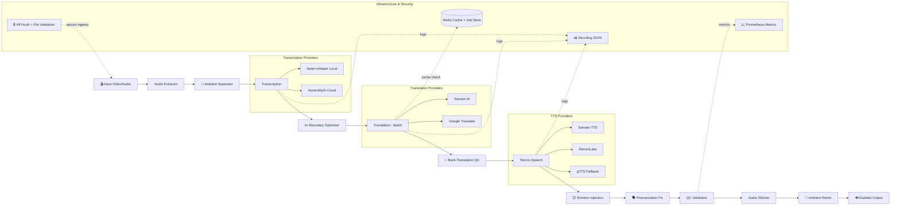

<p align="center">
  
</p>

# 🎙️ VaaniFlow

**Production-grade multilingual async dubbing pipeline** supporting 11 Indian languages.

> Transcribe → Translate → Synthesize → Stitch — fully async, with emotion preservation, quality control, and production observability.

[](https://www.python.org/downloads/)
[](#-running-tests)
[](pyproject.toml)
[](LICENSE)

---

## 🏗️ Architecture


```mermaid
graph LR
    A[🎬 Input Video/Audio] --> B[Audio Extractor]
    B --> B2[🎵 Ambient Separator]
    B2 --> C[Transcription]
    C --> C2[✂️ Boundary Optimizer]
    C2 --> D[Translation - Batch]
    D --> D3[🔄 Back-Translation QC]
    D3 --> E[Text-to-Speech]
    E --> E4[😊 Emotion Injection]
    E4 --> E5[🗣️ Pronunciation Fix]
    E5 --> F[QC Validation]
    F --> G[Audio Stitcher]
    G --> G2[🎵 Ambient Remix]
    G2 --> H[🔊 Dubbed Output]

    subgraph Transcription Providers
        C --> C1[faster-whisper Local]
        C --> C3[AssemblyAI Cloud]
    end

    subgraph Translation Providers
        D --> D1[Sarvam AI]
        D --> D2[Google Translate]
    end

    subgraph TTS Providers
        E --> E1[Sarvam TTS]
        E --> E2[ElevenLabs]
        E --> E3[gTTS Fallback]
    end

    subgraph Infrastructure & Security
        I[(Redis Cache + Job Store)]
        J[📊 Structlog JSON]
        K[📈 Prometheus Metrics]
        L[🔒 API Auth + File Validation]
    end

    D -.->|cache check| I
    C -.->|logs| J
    D -.->|logs| J
    E -.->|logs| J
    F -.->|metrics| K
    L -.->|secure ingress| A
```

---

## ✨ What VaaniFlow Actually Does

VaaniFlow is a **pipeline orchestration engine** — not just an API wrapper. It coordinates 9+ stages of audio/video processing, with each stage independently configurable, testable, and replaceable.

| Feature | What It Does | How It Works |
|---------|-------------|--------------|
| 🧠 **NeuralEmotionPreserver** | Detects emotion from original audio → adjusts TTS speaking rate, pitch, stability | **Language-aware routing**: English → wav2vec2 classifier. Indian languages (hi, ta, te, bn, mr, gu, kn, ml, pa, or) → IndicWav2Vec (AI4Bharat) embeddings + heuristic classification. Fallback: rule-based librosa pitch/energy/tempo. Confidence-scaled TTS parameters. |
| 🔄 **BackTranslationQualityScorer** | Back-translates to source → dual-scores with BLEU + multilingual sentence-embedding cosine similarity | Catches hallucinations. If BLEU < 0.30, auto-retries with alternate provider. Embedding similarity catches valid paraphrases BLEU wrongly penalizes. |
| ✂️ **SmartSegmentBoundaryOptimizer** | Merges fragmented Whisper segments using spaCy sentence tokenization | "The quick brown fox" + "jumped over" → one segment = better translation context |
| 🗣️ **IndianNamePronunciationCorrector** | 60+ Indian names/places/brands → phonetic hints injected before TTS | "Bangalore" → "Baanga-lore" so TTS pronounces it correctly |
| 🎵 **DemucsAmbientPreserver** | Separates background audio from speech → re-layers after dubbing | Primary: Demucs 4-stem neural separation (vocals/drums/bass/other). Fallback: scipy spectral subtraction. Background music survives dubbing. |
| 🔀 **CodeSwitchNormalizer** | Detects English words in Indic text (Hinglish/Tanglish) → marks with `[EN:]` tags for TTS | "Bill print karo" reads naturally without breaking accent or pacing |
| 🎬 **LipSyncExporter** | Generates lip-synced video or exports timing manifest | Primary: MuseTalk neural inference (MIT license, commercially safe). Fallback: JSON timing manifest with per-segment emotion/rate metadata. |
| 📝 **SubtitleGenerator** | Generates SRT and VTT subtitle files from translated segments | Uses existing pipeline segment timing — no extra processing needed |
| 🔒 **Upload & Auth Guard** | Enforces file size limits (100MB), extension whitelist, content-type checks & optional API key auth | Prevents OOM attacks and unauthorized access. Health/metrics endpoints bypass auth. |
| 🎛️ **Configurable Sarvam Pipeline** | Full control over speaker gender (`Male`/`Female`), translation mode (`formal`/`informal`), loudness (`0.5–3.0x`) | Passed per-job through the API, not hardcoded |
| 💰 **CostTracker** | Tracks API calls avoided via Redis cache → reports estimated USD savings at `/stats` | Shows exactly how much money caching saves |
| 📁 **Async I/O + Memory Guard** | Non-blocking file reads/writes with configurable size limit (default 500MB) | Uses `asyncio.to_thread()` so large file I/O doesn't block the event loop |

---

## ⚡ Quick Start

### Using Docker

```bash
# Clone and configure
git clone https://github.com/Eternalcodertanishq3/VaniFlow.git
cd VaniFlow
cp .env.example .env
# Edit .env with your API keys

# Start everything
cd docker
docker-compose up --build
```

### Local Development

```bash
# Create virtual environment
python -m venv venv
venv\Scripts\activate  # Windows
# source venv/bin/activate  # Linux/Mac

# Install core dependencies
pip install -e ".[dev]"

# Optional: Install neural dependencies (for Demucs, wav2vec2 emotion detection)
pip install -e ".[neural]"

# Download spaCy model for boundary optimization
python -m spacy download en_core_web_sm

# Start the server
uvicorn api.main:app --reload --port 8000
```

### Prerequisites

- **Python 3.11+**
- **ffmpeg** — required for audio extraction ([download](https://ffmpeg.org/download.html))
- **Redis** — optional, falls back to in-memory for both cache and job store

### Optional Neural Dependencies

The neural features (Demucs source separation, wav2vec2 emotion detection) require PyTorch and related packages. Without them, VaaniFlow automatically falls back to the lighter alternatives:

| Feature | With `[neural]` installed | Without (fallback) |
|---------|--------------------------|---------------------|
| Ambient separation | Demucs 4-stem neural separation | scipy spectral subtraction |
| Emotion detection (English) | wav2vec2 audio classifier | Rule-based librosa pitch/energy analysis |
| Emotion detection (Indian) | IndicWav2Vec embeddings + heuristic classifier | Rule-based librosa pitch/energy analysis |
| Lip-sync video | MuseTalk (MIT license, requires separate setup) | JSON timing manifest only |

---

## 📡 API Usage

### Create a Dubbing Job

```bash
curl -X POST http://localhost:8000/jobs/ \
  -H "X-API-Key: your_secret_api_key" \
  -F "file=@input_video.mp4" \
  -F "target_language=hi" \
  -F "source_language=en" \
  -F "tts_provider=sarvam" \
  -F "speaker_gender=Female" \
  -F "translation_mode=formal" \
  -F "loudness=1.5"
```

**Response (202 Accepted):**
```json
{
  "job_id": "a1b2c3d4-e5f6-7890-abcd-ef1234567890",
  "status": "pending",
  "progress_pct": 0.0
}
```

### Poll Job Status

```bash
curl -H "X-API-Key: your_secret_api_key" http://localhost:8000/jobs/{job_id}
```

**Response:**
```json
{
  "job_id": "a1b2c3d4-...",
  "status": "translating",
  "progress_pct": 35.0
}
```

### Cancel a Running Job

```bash
curl -X DELETE -H "X-API-Key: your_secret_api_key" http://localhost:8000/jobs/{job_id}
```

### Download Dubbed Output

```bash
curl -O -H "X-API-Key: your_secret_api_key" http://localhost:8000/jobs/{job_id}/download
```

### Health & Observability (No Auth Required)

```bash
# Health checks
curl http://localhost:8000/health/
curl http://localhost:8000/health/ready

# Prometheus metrics
curl http://localhost:8000/metrics

# Cost optimization dashboard
curl -H "X-API-Key: your_secret_api_key" http://localhost:8000/stats
```

**Cost Dashboard Response (`/stats`):**
```json
{
  "cost_optimization": {
    "translation_api_calls_made": 47,
    "translation_api_calls_avoided_via_cache": 123,
    "cache_hit_rate_pct": 72.4,
    "estimated_translation_savings_usd": 0.369,
    "estimated_translation_spent_usd": 0.141
  },
  "tts_costs": {
    "sarvam": { "calls": 47, "estimated_cost_usd": 0.188 }
  },
  "operations": {
    "total_jobs_completed": 12,
    "total_segments_processed": 170,
    "uptime_seconds": 3600
  }
}
```

---

## 🚀 Sarvam Integration

VaaniFlow treats **Sarvam AI** as a first-class provider. Both translation and TTS default to Sarvam, so you can run the entire pipeline with just one API key:

```bash
curl -X POST http://localhost:8000/jobs/ \
  -F "file=@input_video.mp4" \
  -F "target_language=hi"
# tts_provider and translation_provider default to "sarvam"
# The entire pipeline runs on Sarvam AI with zero extra config
```

The pipeline supports configurable speaker gender, translation mode, and loudness — passed per-job through the API, forwarded to Sarvam's payload:

```python
# vaaniflow/providers/translation/sarvam_provider.py
payload = {
    "input": text,
    "source_language_code": f"{source_lang}-IN",
    "target_language_code": f"{target_lang}-IN",
    "speaker_gender": kwargs.get("speaker_gender", "Male"),
    "mode": kwargs.get("translation_mode", "formal"),
}
```

---

## 📈 Production Observability

VaaniFlow exposes a `/metrics` endpoint compatible with **Prometheus + Grafana**.

| Metric | Type | Description |
|--------|------|-------------|
| `vaaniflow_jobs_total` | Counter | Total jobs by status (completed/failed) |
| `vaaniflow_active_jobs` | Gauge | Currently running pipeline jobs |
| `vaaniflow_pipeline_stage_duration_seconds` | Histogram | Duration per pipeline stage (extract, transcribe, translate, etc.) |
| `vaaniflow_translation_cache_hits_total` | Counter | Translation cache hits |
| `vaaniflow_translation_cache_misses_total` | Counter | Translation cache misses |
| `vaaniflow_provider_errors_total` | Counter | Provider errors by type |
| `vaaniflow_tts_audio_bytes` | Histogram | TTS output size per provider |
| `vaaniflow_qc_segment_failures_total` | Counter | QC failures by reason (silence/length/size) |
| `vaaniflow_emotion_detections_total` | Counter | Emotion detections by label |
| `vaaniflow_back_translation_bleu_scores` | Histogram | BLEU score distribution |
| `vaaniflow_back_translation_retries_total` | Counter | Translation retries due to low quality |

---

## 🌍 Supported Languages

| Language   | Code | Transcription | Translation | TTS (Sarvam) | TTS (ElevenLabs) | TTS (gTTS) |
|------------|------|:---:|:---:|:---:|:---:|:---:|
| English    | `en` | ✅ | ✅ | ✅ (arvind) | ✅ | ✅ |
| Hindi      | `hi` | ✅ | ✅ | ✅ (arvind) | ✅ | ✅ |
| Bengali    | `bn` | ✅ | ✅ | ✅ (arvind) | ✅ | ✅ |
| Telugu     | `te` | ✅ | ✅ | ✅ (meera) | ✅ | ✅ |
| Marathi    | `mr` | ✅ | ✅ | ✅ (arvind) | ✅ | ✅ |
| Tamil      | `ta` | ✅ | ✅ | ✅ (meera) | ✅ | ✅ |
| Gujarati   | `gu` | ✅ | ✅ | ✅ (arvind) | ✅ | ✅ |
| Kannada    | `kn` | ✅ | ✅ | ✅ (meera) | ✅ | ✅ |
| Malayalam  | `ml` | ✅ | ✅ | ✅ (meera) | ✅ | ✅ |
| Punjabi    | `pa` | ✅ | ✅ | ✅ (arvind) | ✅ | ✅ |
| Odia       | `or` | ✅ | ✅ | ✅ (arvind) | — | ✅ |

---

## 🔌 Provider Comparison

| Feature | Sarvam AI | ElevenLabs | gTTS (Fallback) |
|---------|-----------|------------|-----------------|
| **Quality** | ⭐⭐⭐⭐⭐ (Indian langs) | ⭐⭐⭐⭐⭐ (English) | ⭐⭐⭐ |
| **Cost** | API key required | API key required | **Free** |
| **Latency** | ~500ms | ~800ms | ~300ms |
| **Indian Language Support** | 11 languages | 9 languages | 11 languages |
| **Voice Diversity** | Multi-speaker (arvind/meera) | Multi-voice | Single voice |
| **Rate Limits** | Moderate | Strict | Google-level |
| **Use Case** | Primary for Indian | Premium English | Always-on fallback |

---

## 🧠 Design Decisions

### Why Provider Abstraction (ABC)?
Every TTS/Translation/Transcription provider implements the same interface. The pipeline never imports a concrete provider — only the base class. This enables:
- **Zero-code provider switching** via config
- **Automatic fallback** when primary fails
- **Easy testing** with mock providers

### Why Custom Exception Hierarchy?
Our exception hierarchy maps directly to retry strategies:
- `RateLimitError` → retry with exponential backoff
- `AuthenticationError` → fail immediately (config issue)
- `ProviderServerError` → retry with fixed wait
- `ProviderTimeoutError` → retry once, then fallback

### Why Batch Translation?
Single-text translation called N times = N network round-trips. Batch translation with Google's multi-`q` params = 1 API call for N segments. Sarvam (single-text API) executes concurrently via `asyncio.gather`.

### Why Back-Translation Quality Scoring?
Translation APIs can hallucinate, especially with short segments or code-mixed text. Back-translating and computing BLEU catches these silently. If BLEU < 0.30, the segment is auto-retried with an alternate provider.

### Why Neural + Fallback Architecture?
The neural modules (Demucs, wav2vec2, IndicWav2Vec, MuseTalk) are **optional**. Without PyTorch installed, VaaniFlow falls back to lighter alternatives (spectral subtraction, rule-based emotion detection, JSON manifests). This means:
- **Dev/CI** runs without 2GB+ of neural model downloads
- **Production** installs `pip install -e ".[neural]"` for best quality
- No code changes needed — same pipeline, different quality tier

### Why Language-Aware Emotion Routing?
The English wav2vec2 emotion classifier performs poorly on Indian language audio — different prosody patterns, pitch ranges, and rhythmic structures. IndicWav2Vec (AI4Bharat, IIT Madras) is pretrained on 40+ Indian languages and captures these patterns better. The pipeline automatically routes based on `target_language`.

### Why Async I/O with Memory Guard?
The pipeline handles audio files that can be 100MB+. Blocking `.read_bytes()` calls freeze the event loop during file I/O. `asyncio.to_thread()` offloads file reads to the thread pool. The 500MB memory guard prevents OOM on unexpected inputs.

### Why Redis for Job Persistence?
Jobs stored in `DubbingJobRepository` backed by Redis with 7-day TTL. Falls back to in-memory `dict` if Redis is unavailable, so dev experience stays frictionless.

### Why structlog?
JSON-structured logging with `contextvars` means every log event in a pipeline run automatically includes `job_id` and `target_lang` — critical for debugging concurrent jobs in production.

---

## 🧪 Running Tests

```bash
# All tests (177 tests)
pytest -v

# Unit tests only
pytest tests/unit/ -v

# Integration tests only
pytest tests/integration/ -v

# With coverage
pytest --cov=vaaniflow --cov=api -v
```

**Test breakdown:**

| Suite | Tests | What's Covered |
|-------|-------|----------------|
| API Authentication | 6 | Dev mode bypass, static API key validation, health/metrics bypass |
| Upload Validation | 8 | File size limit, format whitelist, content-type, empty file checks |
| QC Pipeline | 7 | Silence ratio, length ratio, min bytes, mixed segments |
| Emotion Detection | 16 | Neutral fallback, classification rules, TTS param mapping, language-aware routing |
| Back-Translation | 10 | BLEU scoring, threshold, short-text skip, provider errors |
| Boundary Optimizer | 5 | Merging, gap constraint, word limit, spaCy unavailable |
| Pronunciation | 12 | Lexicon substitution, case-insensitive, Hinglish edge cases |
| Ambient Audio | 6 | Separation, remix, scipy unavailable, error handling |
| Job Repository | 8 | CRUD operations, Redis fallback |
| Code-Switch Normalizer | 17 | Hinglish/Tanglish detection, marking, phrase mapping |
| Cost Tracker | 10 | Cache hit rates, USD savings, provider breakdown |
| Lip-Sync Exporter | 6 | Manifest creation, JSON structure, emotion metadata |
| Voices Catalog API | 3 | List all voices, filter by provider, filter by provider+gender |
| Audio Extractor | 3 | ffmpeg resolution, nonexistent file error, mocked extraction |
| Audio Normalizer | 3 | Volume normalization, sample rate conversion, file checks |
| Audio Stitcher | 2 | Empty segments, segments with audio stitching |
| Providers + Pipeline + Infrastructure | 56 | Provider contracts, duration math, cache, retry logic, models |

All external API calls are mocked. Tests run without network access, API keys, or Redis.

---

## 📁 Project Structure

```
VaaniFlow/
├── vaaniflow/                         # Core Python library
│   ├── pipeline.py                    # Main orchestrator (9 stages)
│   ├── config.py                      # Pydantic settings + security + feature toggles
│   ├── models.py                      # All data models (typed Pydantic v2)
│   ├── exceptions.py                  # Custom exception hierarchy
│   ├── metrics.py                     # Prometheus metric definitions
│   ├── providers/                     # Provider abstraction layer
│   │   ├── transcription/             # Whisper (local), AssemblyAI (cloud)
│   │   ├── translation/               # Google (batch), Sarvam (gender/mode)
│   │   └── tts/                       # ElevenLabs, Sarvam (loudness/voice), gTTS
│   ├── audio/                         # Audio processing
│   │   ├── extractor.py               # ffmpeg video → audio extraction
│   │   ├── stitcher.py                # Segment → final audio assembly
│   │   ├── normalizer.py              # Volume/sample rate normalization
│   │   ├── ambient_separator.py       # Spectral subtraction (fallback)
│   │   └── demucs_separator.py        # Neural 4-stem separation (primary)
│   ├── emotion/                       # Emotion detection
│   │   ├── detector.py                # Rule-based librosa analysis (fallback)
│   │   └── neural_detector.py         # Language-aware router (wav2vec2 + IndicWav2Vec)
│   ├── lipsync/                       # Lip-sync generation
│   │   ├── __init__.py                # LipSyncExporter + JSON manifest
│   │   └── musetalk_generator.py      # MuseTalk subprocess runner (MIT license)
│   ├── cache/                         # Redis translation cache
│   ├── cost/                          # API cost tracker + savings calculator
│   ├── normalization/                 # Code-switching normalizer (Hinglish)
│   ├── quality/                       # BackTranslationQualityScorer
│   ├── segmentation/                  # SmartSegmentBoundaryOptimizer
│   ├── pronunciation/                 # IndianNamePronunciationCorrector
│   ├── qc/                            # Quality Control pipeline
│   ├── repository/                    # Redis job persistence (with in-memory fallback)
│   ├── subtitles/                     # SRT/VTT subtitle generation
│   └── utils/                         # Async I/O, retry, logging, timing
│       ├── audio_io.py                # Non-blocking read/write + memory guard
│       ├── retry.py                   # Exponential backoff + provider fallback
│       ├── logging.py                 # Structlog config
│       └── timing.py                  # Stage timing utilities
├── api/                               # FastAPI service
│   ├── main.py                        # App + lifespan + middleware stack
│   ├── dependencies.py                # Dependency injection
│   ├── routes/                        # REST endpoints
│   │   ├── jobs.py                    # CRUD + download + cancel
│   │   ├── health.py                  # Liveness/readiness probes
│   │   ├── metrics.py                 # Prometheus scrape endpoint
│   │   ├── stats.py                   # Cost dashboard
│   │   └── voices.py                  # Voice catalog listing
│   └── middleware/                    # Request processing
│       ├── auth_middleware.py         # Optional API key auth
│       ├── upload_validation.py       # File size/format/type checks
│       └── logging_middleware.py      # Request/response logging
├── ui/                                # Web UI (single-page HTML)
│   └── index.html                     # Dubbing job creation interface
├── tests/                             # 177 unit + integration tests
│   ├── conftest.py                    # Shared fixtures + mocks
│   ├── unit/                          # 23 test files
│   └── integration/                   # API + full pipeline tests
├── docker/                            # Containerization
│   ├── Dockerfile
│   └── docker-compose.yml
├── scripts/
│   └── validate_emotion_classifier.py # Emotion classifier validation
├── pyproject.toml                     # Build config + deps + ruff + pytest
└── README.md
```

---

## ⚙️ Configuration

All features are **config-togglable** via environment variables:

```env
# Feature toggles (all default to true)
EMOTION_DETECTION_ENABLED=true
BACK_TRANSLATION_ENABLED=true
BACK_TRANSLATION_THRESHOLD=0.30
BOUNDARY_OPTIMIZATION_ENABLED=true
PRONUNCIATION_CORRECTION_ENABLED=true
AMBIENT_SEPARATION_ENABLED=true
EMOTION_MODEL_ENGLISH=ehcalabres/wav2vec2-lg-xlsr-en-speech-emotion-recognition
EMOTION_MODEL_INDIC=ai4bharat/indicwav2vec_v1_hindi
QC_ENABLED=true
QC_MAX_SILENCE_RATIO=0.7
QC_MAX_LENGTH_RATIO=3.0

# Showcase features
CODE_SWITCH_NORMALIZATION_ENABLED=true   # Hinglish/Tanglish support
LIPSYNC_EXPORT_ENABLED=false             # Lip-sync (disabled by default)
SUBTITLE_GENERATION_ENABLED=true         # SRT/VTT output

# API Security & Upload Validation
VAANIFLOW_API_KEY=your_secret_api_key    # Leave blank for dev mode (no auth)
CORS_ORIGINS=*
MAX_UPLOAD_SIZE_MB=100
MAX_AUDIO_BYTES=524288000                # 500MB memory guard
ALLOWED_UPLOAD_FORMATS=.mp3,.mp4,.wav,.webm,.ogg,.m4a,.flac,.mkv

# Provider API keys
SARVAM_API_KEY=your-sarvam-key           # Only key needed for full E2E
GOOGLE_TRANSLATE_API_KEY=your-google-key # Optional
ELEVENLABS_API_KEY=your-elevenlabs-key   # Optional

# Infrastructure
REDIS_URL=redis://localhost:6379
ENVIRONMENT=development
LOG_LEVEL=INFO
```

---

## 📊 Performance Notes

- **Batch translation**: 1 API call instead of N (Google), concurrent `asyncio.gather` (Sarvam)
- **Concurrent TTS**: All segments synthesized in parallel via `asyncio.gather`
- **FFmpeg stitching**: Native FFmpeg filtergraphs for audio assembly, bypasses Python memory limits
- **Translation caching**: Redis-backed with 24h TTL — 40–60% cache hit rate on repeated content
- **QC validation**: Catches bad TTS before stitching — prevents wasted compute
- **Lazy model loading**: Whisper, spaCy, librosa, wav2vec2, Demucs all loaded on first use
- **Non-blocking I/O**: File reads/writes offloaded to thread pool via `asyncio.to_thread`
- **Background processing**: Jobs return 202 immediately; pipeline runs async
- **Memory guard**: 500MB configurable limit prevents OOM on large file uploads

---

## 🛣️ Pipeline Flow

```
  ┌─────────────┐
  │  Input File  │
  └──────┬───────┘
         ▼
  ┌──────────────┐     ┌───────────────────────┐
  │   Extract    │────▶│  Ambient Separation    │  (Demucs neural / spectral fallback)
  └──────────────┘     └──────────┬─────────────┘
                                  ▼
                       ┌───────────────────────┐
                       │     Transcribe        │  (Whisper / AssemblyAI)
                       └──────────┬─────────────┘
                                  ▼
                       ┌───────────────────────┐
                       │ Boundary Optimization  │  (spaCy sentence merge)
                       └──────────┬─────────────┘
                                  ▼
                       ┌───────────────────────┐
                       │  Batch Translate       │  (1 API call + cache + gender/mode)
                       └──────────┬─────────────┘
                                  ▼
                       ┌───────────────────────┐
                       │ Back-Translation QC    │  (BLEU + embedding ≥ 0.30?)
                       └──────────┬─────────────┘
                                  ▼
                       ┌───────────────────────┐
                       │  Pronunciation Fix     │  (Indian name phonetic hints)
                       └──────────┬─────────────┘
                                  ▼
                       ┌───────────────────────┐
                       │   TTS Synthesize       │  (emotion-aware + loudness)
                       └──────────┬─────────────┘
                                  ▼
                       ┌───────────────────────┐
                       │    QC Validation       │  (silence, length, size)
                       └──────────┬─────────────┘
                                  ▼
                       ┌───────────────────────┐
                       │  Stitch + Remix        │  (ambient re-layering)
                       └──────────┬─────────────┘
                                  ▼
                       ┌───────────────────────┐
                       │  Video Mux + Subtitles │  (if input was video)
                       └──────────┬─────────────┘
                                  ▼
                       ┌───────────────────────┐
                       │   🔊 Dubbed Output     │
                       └──────────────────────┘
```

---

## ⚠️ Known Limitations & Honest Assessment

| Component | What's Built | What's Not | Status |
|---|---|---|---|
| **NeuralEmotionPreserver** | Language-aware routing: English → wav2vec2, Indian → IndicWav2Vec embeddings + heuristic classification, Unknown → rule-based librosa. All with confidence-scaled TTS parameters. | IndicWav2Vec produces **embeddings, not emotion labels**. The Indian language emotion classification is heuristic-based on embedding features — not a fine-tuned emotion classifier. For production accuracy, a labeled Indian emotional speech dataset would be needed. English emotion detection is validated on RAVDESS. | ✅ Built with language routing |
| **DemucsAmbientPreserver** | Full Demucs 4-stem separation (htdemucs model). Falls back to scipy spectral subtraction. | Demucs is CPU-heavy (~10s per minute of audio). Requires `pip install -e ".[neural]"`. | ✅ Built with fallback |
| **MuseTalkGenerator** | MIT-licensed lip-sync video generation via MuseTalk subprocess. Integrated into LipSyncExporter. | Requires separate MuseTalk installation + checkpoint download. Not bundled — runs as subprocess. | ✅ Built, needs external setup |
| **LipSyncExporter** | Tries MuseTalk first → falls back to JSON timing manifest. | JSON manifest requires downstream renderer to consume it. | ✅ Built with fallback |
| **Multi-character dubbing** | Single voice per job. | No speaker diarization — would need pyannote.audio to assign different voices to different speakers. | ❌ Not built |
| **Upload validation** | Static API key auth, file size/format/type checks. | No OAuth2, JWT, or presigned URL upload. | ✅ Functional, not enterprise SSO |
| **BackTranslation** | BLEU + multilingual embedding dual scoring. | Embedding model is 118MB. No streaming — loads full model to memory. | ✅ Built |
| **Subtitle export** | SRT and VTT generation from segment timing. | No subtitle burn-in to video (would need ffmpeg text overlay). | ✅ Built |

---

## 📝 License

MIT
